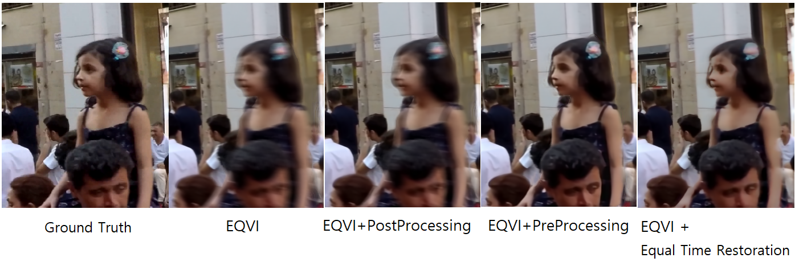

# Deblurred EQVI
## Most of the code was taken from here...
 - [EQVI](https://github.com/friendship1/deblur_EQVI/blob/main/.gitignore)
 - [UTI-VFI](https://github.com/yjzhang96/UTI-VFI)
 - [CDVD-TSP](https://github.com/csbhr/CDVD-TSP)


little modification is done by: Jungwan Woo and Donghyeon Kim





## Preparation (Same explaination from EQVI)
### Dependencies 


you can find more information on [EQVI github](https://github.com/friendship1/deblur_EQVI/blob/main/.gitignore)
1. Install correlation package
2. Download pretrained models from [EQVI github](https://github.com/friendship1/deblur_EQVI/blob/main/.gitignore)
3. Data preparation from [here](https://competitions.codalab.org/competitions/24584#participate-get-data)


## Quick Testing
1. Specify the inference settings  
modify `configs/config_xxx.py`, including:  

 
2. Execute the following command to start inference:
  - For REDS_VTSR dataset, you could use `interpolate_REDS_VTSR.py` to produce the interpolated frames in the same naming manner. For example, given the input frames 00000000.png and 00000008.png, if we choose to interpolate 3 frames (`inter_frames=3`), then the output frames are automatically named as 00000002.png, 00000004.png and 00000006.png.
```
CUDA_VISIBLE_DEVICES=0 python interpolate_REDS_VTSR.py configs/config_xxx.py
```
Note: `interpolate_REDS_VTSR.py` is specially coded with REDS_VTSR dataset.

:zap: Now we support testing for arbitrary dataset with a generic inference script `interpolate_EQVI.py`. 
  - For other datasets, run the following command. For example, given input frames 001.png and 002.png, if we choose to interpolate 3 frames (`inter_frames=3`), then the output frames will be named as 001_0.png, 001_1.png, 001_2.png.
```
CUDA_VISIBLE_DEVICES=0 python interpolate_EQVI.py configs/config_xxx.py
```
The output results will be stored in the specified `$store_path$`.  

## Training
1. Specify the training settings in `configs/config_train_EQVI_VTSR.py`
2.  execute the following commands:  
`CUDA_VISIBLE_DEVICES=0,1,2,3 python train_EQVI_lap_l1.py --config configs/config_train_EQVI_VTSR.py`  
Note:  
(1) This will train EQVI model with equipping RCSN and RQFP from scratch. The performance is better than the results we reported in the paper.  
(2) We print training logs after each epoch, so it dose **take a while to show the logs**. Specifically, we use 4 GTX 2080Ti GPUs to train the model. About 3600s for one epoch. The training procedure lasts about 3-5 days.  
(3) The dataloader is coded with REDS_VTSR dataset. If you want to train on your own dataset, you may need to modify or rewrite the dataloader file.


## Evaluation
1. You can evaluate metric PSNR and SSIM from final output image through metric_calculate.py code

